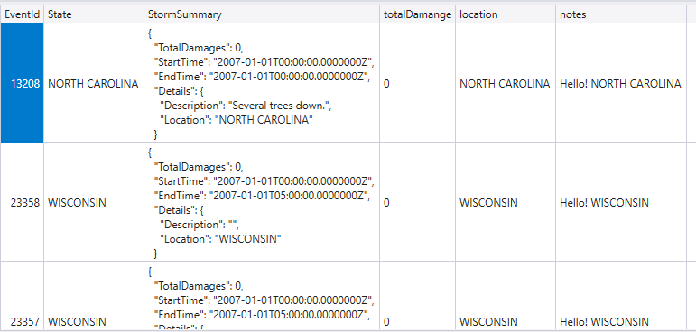

# kusto-query-example

I keep some interesting Kusto queries in this repo. 

- [Python Parse Json](./python-plugin/python-parse-json.kql)
_This Kusto query uses StormEvents example table. It uses python to parse JSON instead of using the standard KQL parse_json function. The purpose is to __demo how to create an ad-hoc Kusto function which is mainly written in python__._

<u>Refence</u> 
    - [Azure Data Explorer support for inline Python is GA](https://techcommunity.microsoft.com/t5/azure-data-explorer/azure-data-explorer-support-for-inline-python-is-ga/ba-p/1283836)
    - [Python plugin](https://docs.microsoft.com/en-us/azure/data-explorer/kusto/query/pythonplugin?pivots=azuredataexplorer)
    - [Debug Kusto query language inline Python using VS Code](https://docs.microsoft.com/en-us/azure/data-explorer/debug-inline-python)
    - [How to score ONNX models in Azure Data Explorer](https://www.drware.com/how-to-score-onnx-models-in-azure-data-explorer/)
